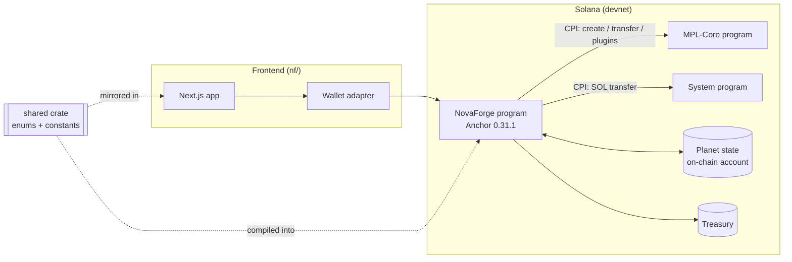
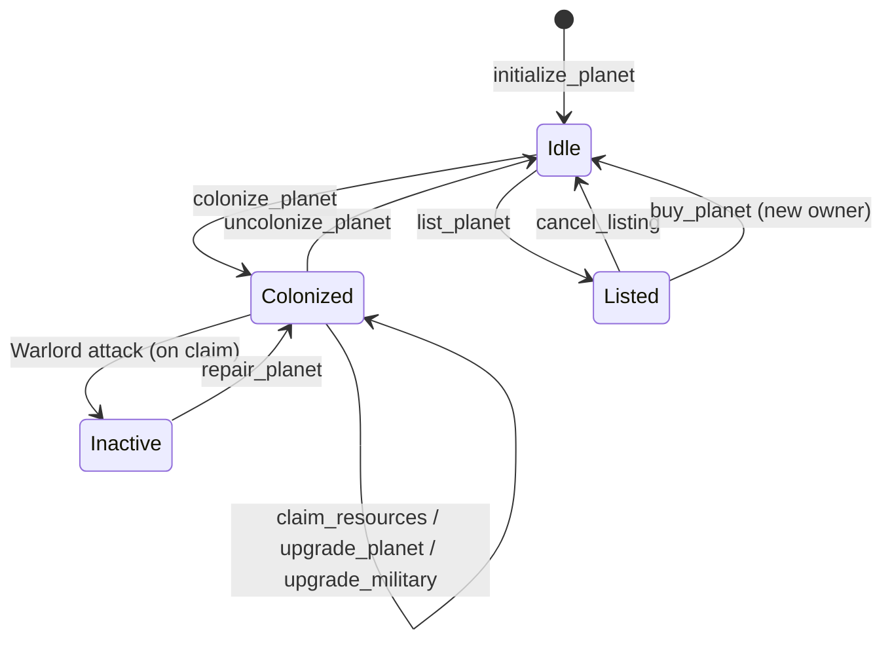

# ⬡ NovaForge

**An on-chain idle strategy game on Solana where Planet NFTs are productive assets.**

> Mint a planet → Colonize → Generate Iron, Gold & Uranium → Claim → Upgrade → Defend → Sell

NovaForge turns each planet into a Metaplex MPL-Core NFT that also carries game state. Owners colonize a planet to start passive resource generation, claim resources on demand, spend them on upgrades and military, and trade planets on a built-in marketplace. Unclaimed planets attract "Void Swarm" monsters, so idling has a risk cost.

**Status:** under active development · deployed to Solana devnet

---

## Table of Contents

1. [Architecture Overview](#architecture-overview)
2. [Repository Layout](#repository-layout)
3. [On-Chain Program](#on-chain-program)
4. [Shared Crate](#shared-crate)
5. [Game Systems](#game-systems)
6. [Marketplace Flow](#marketplace-flow)
7. [Events](#events)
8. [Frontend](#frontend)
9. [Testing](#testing)
10. [Tech Stack](#tech-stack)
11. [Getting Started](#getting-started)
12. [Devnet Deployment](#devnet-deployment)
13. [Known Issues](#known-issues)

---

## Architecture Overview



**Design in one paragraph.** Each planet is two linked things: an **MPL-Core asset** (ownership, transferability, marketplace freeze) and a **Planet state account** owned by the NovaForge program (level, type, rarity, threat, timestamps, listing data). The program never custodies the NFT during a listing. It instead applies MPL-Core's `FreezeDelegate` plugin so the asset stays in the seller's wallet but cannot be moved until the sale or cancellation. Resource generation is **lazy**: nothing runs on a timer. Production and monster threat are computed from elapsed time when the owner calls `claim_resources`.

---

## Repository Layout

```
NovaForge/
├── programs/
│   └── novaforge/        # Anchor program (instructions, state, events, errors)
├── shared/               # Shared Rust crate: enums + game constants
├── tests/                # LiteSVM test suite
├── nf/                   # Frontend application
├── migrations/           # Anchor deploy script
├── Anchor.toml           # Anchor config (toolchain, cluster, program id)
├── Cargo.toml            # Workspace: programs/* + shared
├── rust-toolchain.toml   # Pinned Rust toolchain
├── package.json / yarn.lock / tsconfig.json
├── notes.txt             # Dev notes / current issues
└── novaforge dep.png     # Deployment screenshot
```

Cargo workspace members are `programs/*` and `shared`, resolver 2. The release profile enables `overflow-checks = true`, fat LTO and a single codegen unit.

---

## On-Chain Program

Built with **Anchor 0.31.1** and **MPL-Core 0.11.1**.

### Instructions

| Instruction | Purpose |
|---|---|
| `initialize_planet` | Mint a planet NFT via MPL-Core and create its state account |
| `colonize_planet` | Start resource generation |
| `uncolonize_planet` | Stop resource generation |
| `claim_resources` | Collect Iron, Gold and Uranium; lazily evaluates Void Swarm monster attacks |
| `upgrade_planet` | Spend resources to level up the planet |
| `upgrade_military` | Raise defense against monster attacks |
| `repair_planet` | Restore an inactive planet after a Warlord attack |
| `check_threat` | Evaluate the current threat level for a planet |
| `list_planet` | List on the marketplace; freezes the NFT with MPL-Core `FreezeDelegate` |
| `buy_planet` | Pay SOL (99% seller / 1% treasury) and transfer the NFT via MPL-Core |
| `cancel_listing` | Unfreeze the NFT and delist it |

### Planet state

The Planet account tracks, among other fields:

- `threat_level` — current monster threat (0–100)
- `inactive` — set when a planet is knocked out by a Warlord attack; cleared by `repair_planet`
- `listed` — whether the planet is currently on the marketplace
- `price` — listing price in lamports

<!-- TODO: add full field list (owner, mint/asset, planet_type, rarity, level, military level, last_claim_ts, colonized flag, bump) and PDA seeds from programs/novaforge/src/state -->

### Lifecycle



---

## Shared Crate

`shared/` is a plain Rust crate (workspace member) holding types and constants that must stay consistent between the program, tests and client.

- **`PlanetType`** — Mining, Energy, Luxury, Research, Military
- **`Rarity`** — Common, Rare, Epic, Legendary
- **`MonsterType`** — Rock Golem, Space Pirates, Alien Swarm, Plasma Wraith, Void Titan
- **Game constants** — production rates, upgrade costs, threat thresholds, fee basis points

<!-- TODO: list the actual constant values from shared/src -->

---

## Game Systems

### Resource generation

Colonized planets generate **Iron, Gold and Uranium**. Output is computed lazily at claim time from the time elapsed since the last claim, scaled by planet type, rarity and level.

### Monster system ("Void Swarm")

- **Threat level** rises with time left unclaimed, on a 0–100 scale.
- **Tiers** are chosen by hours elapsed: **Scout → Raider → Warlord**.
- **Planet-type-specific monsters** each have their own loot behavior.
- **Military planets** get a −20 threat reduction.
- `upgrade_military` strengthens defense against attacks.
- A **Warlord** attack marks the planet `inactive` until `repair_planet` is called.
- Evaluation is **lazy**: it runs inside `claim_resources` (and `check_threat`), not on a schedule.

### Progression

`upgrade_planet` consumes resources to level a planet up, and `upgrade_military` does the same for defense, creating a trade-off between production and safety.

---

## Marketplace Flow

The marketplace is built into the same program, with no separate escrow account.

1. **List** — `list_planet` sets `listed = true` and `price`, then applies the MPL-Core **FreezeDelegate** plugin so the NFT cannot be transferred while listed. The NFT stays in the seller's wallet.
2. **Buy** — `buy_planet` transfers SOL (**99% to the seller, 1% to the treasury**), then transfers the NFT to the buyer via MPL-Core.
3. **Cancel** — `cancel_listing` unfreezes the asset and clears listing state.

---

## Events

Emitted by the program for indexers and the frontend:

`ResourcesClaimed` · `PlanetUpgraded` · `MilitaryUpgraded` · `PlanetRepaired` · `PlanetListed` · `PlanetSold` · `ListingCancelled`

---

## Frontend

Located in `nf/` (also archived as `novafend.zip`). A Next.js 14 app that connects a Solana wallet and calls the program's instructions.

<!-- TODO: document pages/components, wallet adapter setup, IDL import, and env vars (RPC URL, program id) -->

---

## Testing

The suite lives in `tests/` and uses **LiteSVM** for fast in-process program testing, with no local validator required.

```bash
cargo test
```

(`Anchor.toml` maps `test` to `cargo test`.)

---

## Tech Stack

| Layer | Technology |
|---|---|
| Chain | Solana |
| Program framework | Anchor 0.31.1 |
| NFT standard | Metaplex MPL-Core 0.11.1 |
| Language | Rust 1.85.0 |
| Testing | LiteSVM |
| Frontend | Next.js 14 / TypeScript |
| Package manager | yarn |

---

## Getting Started

```bash
# 1. Install JS deps
yarn install

# 2. Build the program
anchor build

# 3. Run tests
cargo test

# 4. Deploy to devnet (wallet: ~/.config/solana/id.json)
anchor deploy --provider.cluster devnet
```

`Anchor.toml` is configured for `devnet` with the wallet at `~/.config/solana/id.json`.

---

## Devnet Deployment

- **Program ID:** `GiQ6ov39xDr4HrU1gM9kVJ82e9cVJh5xYMZ8qNtsxMP9`
- **Deploy signature:** `3Chkp68CT7HZiwhCwY52cv3KRny7uDRHciuyiwkE8zLvJcXBcWwwyYbeK7PU3gLQzQEZAxqKYUHRuyt59Qicp5jL`

> ⚠️ `Anchor.toml` currently lists a different `[programs.devnet]` id (`4RmfPaedo1BpddXzwASa2LU6YJ9pZ6XafwJGxRm22bsB`). Make sure `declare_id!`, `Anchor.toml` and this README all agree before the next deploy.

---

## Known Issues

- `anchor build` can fail when platform-tools v1.43 (rustc 1.79) pulls crates that need Rust Edition 2024. Keep the Rust toolchain pinned and the Anchor version at 0.31.1.
- Anchor 1.1.2 caused a CPI type mismatch in `buy_planet`; reverting to Anchor 0.31.1 resolved it.

---

## License

TBD
